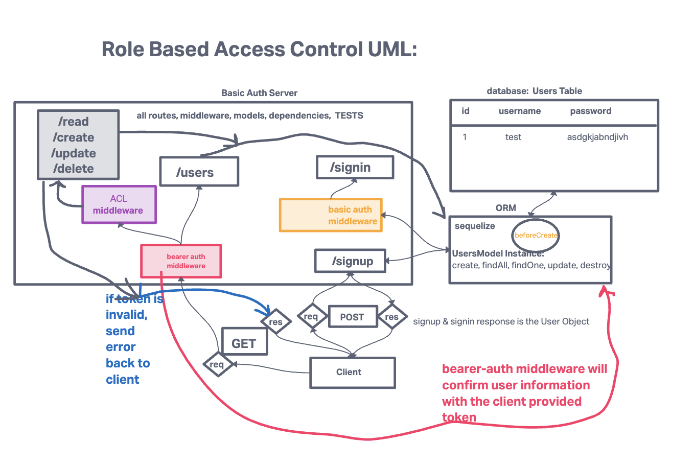

# LAB - Class 08

## Project: Auth-api

### Author: Heather Holcomb | 401d53

### Problem Domain

An Express/Node.js based server using a custom “authentication” module that is designed to handle user registration and sign in using Basic, Bearer, or OAuth along with a custom “authorization” module that will grant/deny users access to the server based on their role or permissions level.

In this final phase, the new requirement is to extend the restrictive capabilities of our routes to our API, implementing a fully functional, authenticated and authorized API Server using the latest coding techniques.

Specifically, we want to make the following restrictions:

- Regular users can READ.
- Writers can READ and CREATE.
- Editors can READ, CREATE, and UPDATE.
- Administrators can READ, CREATE, UPDATE, and DELETE.
- Routes that end up performing those actions in our API/Database need to be protected by both a valid user and that user’s permissions.

### Links and Resources

- [GitHub Actions ci/cd](https://github.com/rkgallaway/server-deployment-practice-d51/actions)
- [back-end server url](http://xyz.com) (when applicable)
- [front-end application](http://xyz.com) (when applicable)

### Collaborators

Referenced lecture demo for class 08 and code review in class 09 with instructor Ryan Gallaway

### Setup

1. Clone this repo into your local environment
2. `npm init -y`
3. `npm i cors express jest supertest sequelize sequelize-cli sqlite3 pg base-64 bcrypt eslint dotenv`

#### `.env` requirements (where applicable)

- `PORT` - 3001
- `DATABASE_URL` - see `.env.sample`

#### How to initialize/run your application (where applicable)

- `npm start` or `nodemon`

#### How to use your library (where applicable)

#### Features / Routes

Auth Module Requirements
- Users can create an account, associated with a “role”
- User Roles will be pre-defined and will each have a list of allowed capabilities
    - `admin` can read, create, update, delete
    - `editor` can read, create, update
    - `writer` can read, create
    - `user` can read
- Users can then login with a valid username and password
- Alternatively, users can login using an OAuth provider such as Google or GitHub
    - In this case, users should be automatically assigned the role of user
- Once logged in, Users can then access any route on the server, so long as they are permitted by the capabilities that match their role.
    - For example, a route that deletes records should only work if your user role is “admin”

#### Tests

- `npm test`
- How do you run tests?
- Any tests of note?
- Describe any tests that you did not complete, skipped, etc

#### UML

